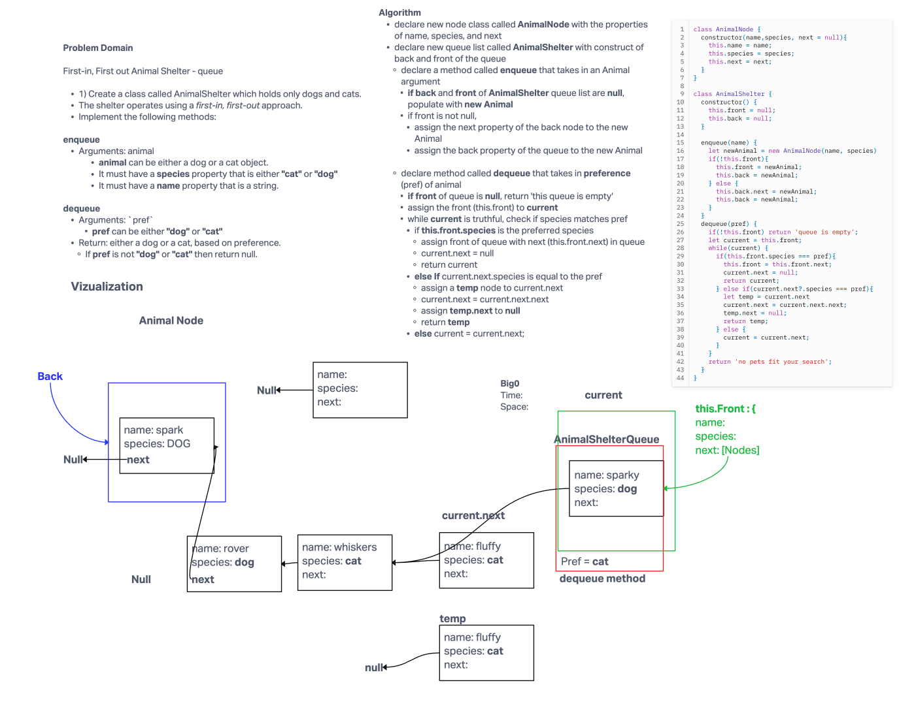

# Stack and Queue - Animal Shelter Queue

Collaboration with Kenya Womack.

Great a First-in, First out queue system for the an Animal Shelter that only accepts dogs and cats.

Create a class called AnimalShelter which holds only dogs and cats. The shelter operates using a first-in, first-out approach. Implement the following methods:

**Enqueue**
>Arguments: animal
>>animal can be either a dog or a cat object.
>>It must have a species property that is either "cat" or "dog"
>>It must have a name property that is a string.

**Dequeue**
>Arguments: `pref`
>>pref can be either "dog" or "cat"
>>Return: either a dog or a cat, based on preference.
>>If pref is not "dog" or "cat" then return null.

## Whiteboard Process

## Approach & Efficiency

BigO Time - O(n) since the time scaling is linear based on the size of the input\
BigO Space - O(1) since the size of the input and output does not change.

## Solution

git clone this repository into a desired location.\
Inside the repository, run `npm install`.\
Navigate to the JavaScript folder and run `npm test animal-shelter-queue.test.js`

[Animal Shelter Queue Code](./index.js)

[animal-shelter-queue.test.js](./__test__/animal-shelter-queue.test.js)
