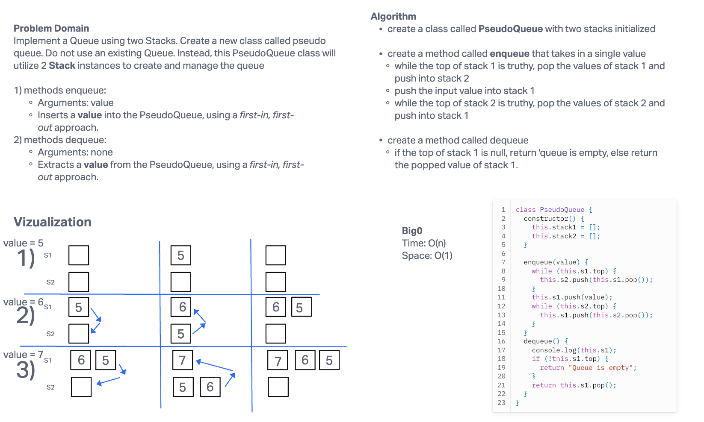

# Stack and Queue - Pseudo-Queue

The goal of this challenge is to implement a Queue using two Stacks. Create a new class called pseudo queue. Do not use an existing Queue. Instead, this PseudoQueue class will  utilize 2 Stack instances to create and manage the queue

## Whiteboard Process

## Approach & Efficiency

BigO Time - O(n) since the time scaling is linear based on the size of the input\
BigO Space - O(1) since the size of the input and output does not change.

## Solution

git clone this repository into a desired location.\
Inside the repository, run `npm install`.\
Navigate to the JavaScript folder and run `npm test linked-list.test.js`

[Stack and PseudoQueue](./../index.js)

[stack-queue-pseudo.test.js](./stack-queue-pseudo.test.js)
