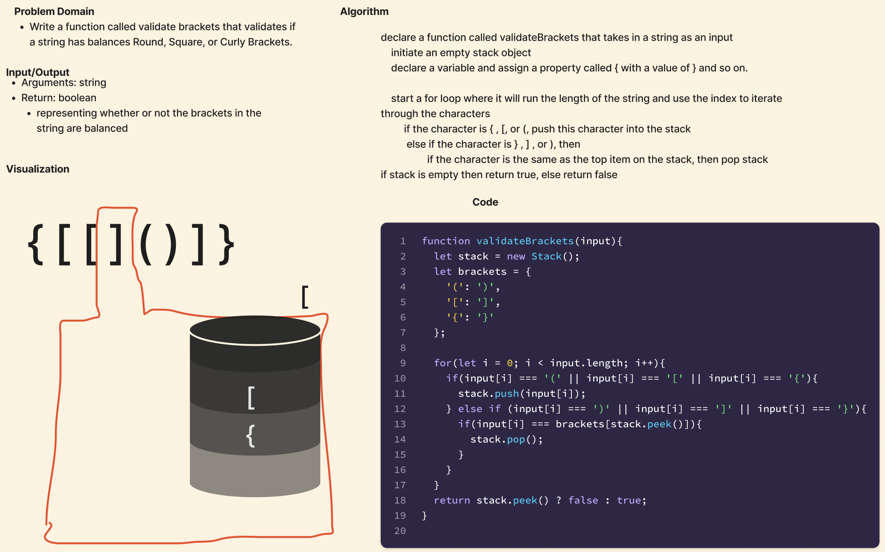

# Stack and Queue Brackets

The goal of this challenge was to create a function that takes in a string and returns a boolean if the brackets are balanced.

## Whiteboard Process

## Approach & Efficiency

The visual above shows the approach I took to solve this problem. Any opening bracket was pushed into the stack. Then the top of the stack was compared to the closing bracket. If they matched, the top of the stack was popped off. If the stack finished the function empty, the brackets were balanced and function returns true. If the stack was not empty, the brackets were not balanced and the function returned false.

## Solution

git clone this repository into a desired location.\
Inside the repository, run `npm install`.\
Navigate to the JavaScript folder and run `npm test stack-queue-brackets.test.js`
Run `npm test stack-queue-brackets.test.js`

[Stack and Queue Construct](/javascript/linked-list/index.js)

[stack-queue-brackets.test.js](./__test__/stack-queue-brackets.test.js)
