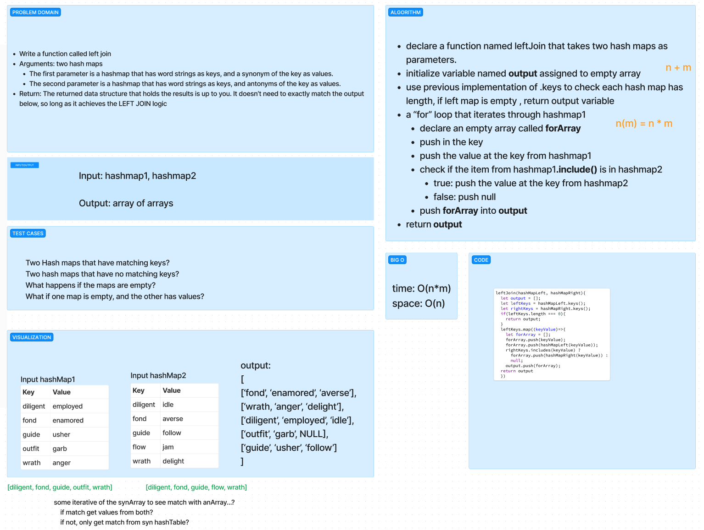

# Hash - Join left

The goal of this challenge was to create a function that takes two hashMap. One hashMap pairs a key to a value of a synonym. The other hashMap pairs a key to a value of an antonym. Returns a data set has joined the data from the antonym to synonym in a data set of choice.

## Whiteboard Process

## Approach & Efficiency

The Big O of time for this function is O(n) where n is the number of elements in the hashMap for the synonyms. Because we use the built in function of the hashMap to determine if there is a key that matches the key of the antonym hashMap, we are only traversing the synonym hashMap once and never have to traverse the hashMap for the antonyms.\
The Big O of space for this function is O(n) as we will be creating a new data structure.

## Solution

git clone this repository into a desired location.\
Inside the repository, run `npm install`.\
Navigate to the JavaScript folder and run `npm test hashmap-left-join.test.js`

[Stack and Queue Construct](/javascript/code401/hash/hashmap-left-join/hashmap-left-join.test.js)
