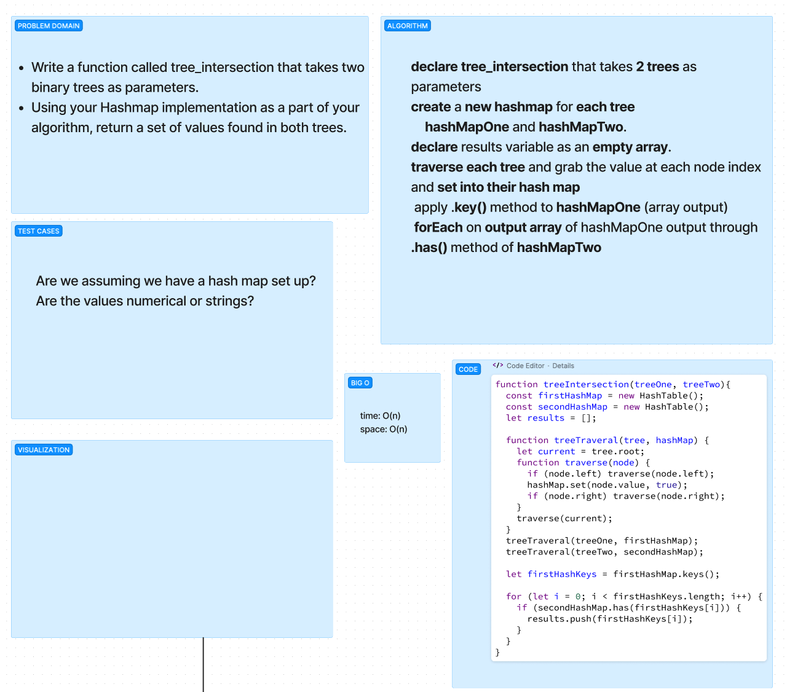

# Hash - Tree Intersection

## Problem Domain

The goal of this challenge was to create a function that takes two trees and returns the value that is found in both trees.

## Whiteboard Process

## Approach & Efficiency

The Big O of time for this function is O(n) because will take O(n) + O(m) to traverse both trees. O(n + m) is simplified to O(n).\
The Big O of space for this function is O(n) as we will be creating a new data structure.

## Solution

git clone this repository into a desired location.\
Inside the repository, run `npm install`.\
Navigate to the JavaScript folder and run `npm test tree-intersection.test.js`

[Tree-intersection and tests](./tree-intersection.test.js)
