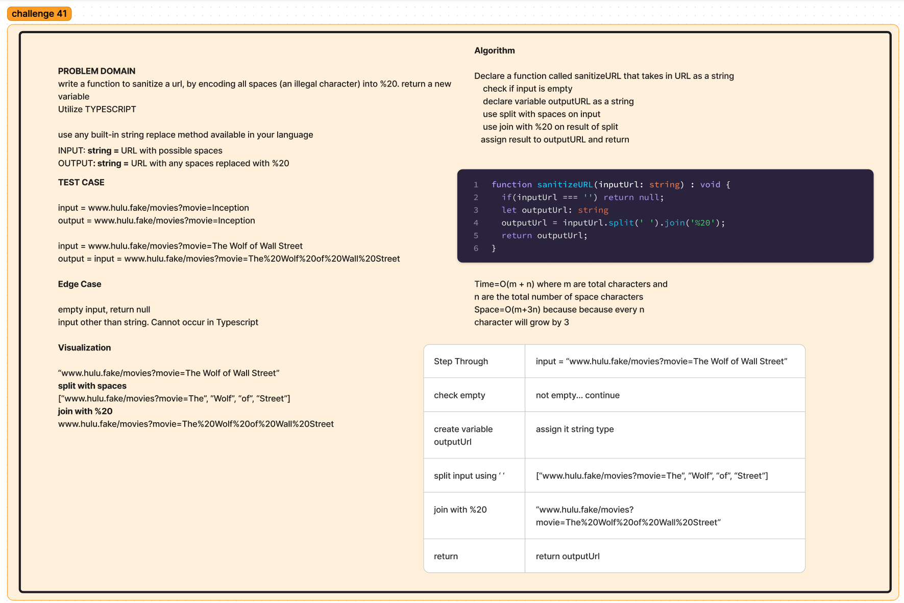

# Replace string character using TypeScript

## Challenge

Write a function to sanitize a url, by encoding all spaces (an illegal character) into %20. Return a new variable. Utilize TypeScript.

## Approach & Efficiency

Was able to use built-in functions. Since challenge was relatively easy, TypeScript was used as practice.

Time=O(m + n) where m are total characters and n are the total number of space characters.

Space=O(m + 3n) because because every n character will grow by 3

## Solution

[TypeScript solution](./index.ts)

