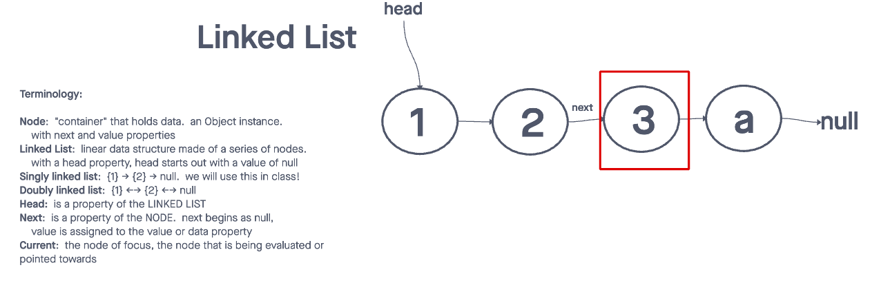

# Linked List Implementation

The goal of this challenge is to understand the basics of a linked list.

## Whiteboard Process

This image is taken from the whiteboard session from Ryan Gallaway's lesson over linked list

## Approach & Efficiency

The approach to understating linked list was to review the lesson taught by Ryan. This content was supplemented by this YouTube video over [Linked List](https://www.youtube.com/watch?v=ZBdE8DElQQU).

## Solution

git clone this repository into a desired location.\
Inside the repository, run `npm install`.\
Navigate to the JavaScript folder and run `npm test linked-list.test.js`

[Linked List Construct](/javascript/linked-list/index.js)

[linked-list.test.js](./__tests__/linked-list.test.js)
