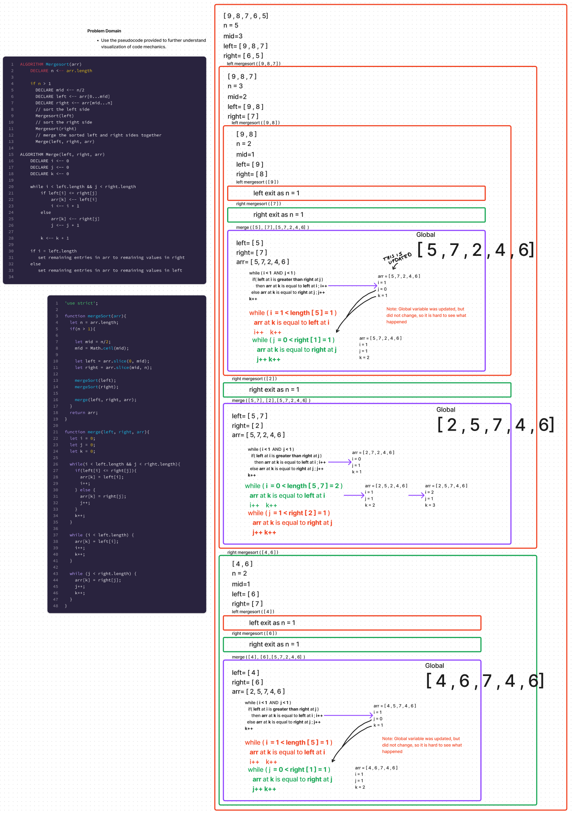

# Merge Sort Pseudocode Start

## Problem Domain

Use the pseudocode provided to further understand visualization of code mechanics.

```
ALGORITHM Mergesort(arr)
    DECLARE n <-- arr.length

    if n > 1
      DECLARE mid <-- n/2
      DECLARE left <-- arr[0...mid]
      DECLARE right <-- arr[mid...n]
      // sort the left side
      Mergesort(left)
      // sort the right side
      Mergesort(right)
      // merge the sorted left and right sides together
      Merge(left, right, arr)

ALGORITHM Merge(left, right, arr)
    DECLARE i <-- 0
    DECLARE j <-- 0
    DECLARE k <-- 0

    while i < left.length && j < right.length
        if left[i] <= right[j]
            arr[k] <-- left[i]
            i <-- i + 1
        else
            arr[k] <-- right[j]
            j <-- j + 1

        k <-- k + 1

    if i = left.length
       set remaining entries in arr to remaining values in right
    else
       set remaining entries in arr to remaining values in left
```

## Whiteboard Process



## Approach & Efficiency

BigO Time -  O(n log n) since the algorithm splits the array in half and then sorts the halves, it means that the algorithm will take O(log n) time to split the array. The merge function will take O(n) time since it will need to iterate through the array to sort it.\
BigO Space - O(n) since the algorithms more variable to store the data as it is being sorted.

## Solution

git clone this repository into a desired location.\
Inside the repository, run `npm install`.\
Navigate to the JavaScript folder and run `npm test sortMerge.test.js`

[sortMerge.test.js](./sortMerge.test.js)
