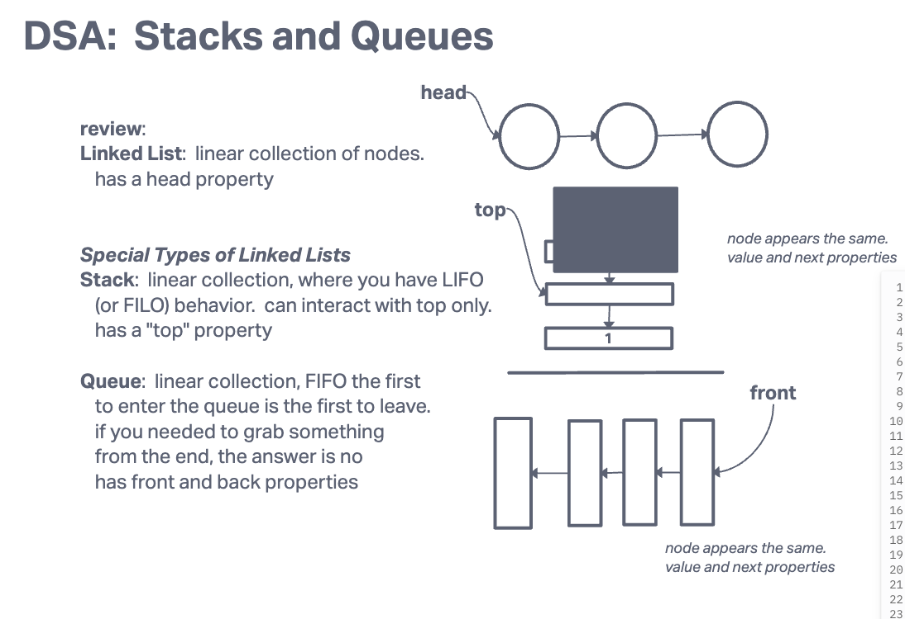

# Stack and Queue Implementation

The goal of this challenge was to understand the basics of a stack and queue, a special type of linked list.

## Whiteboard Process

This image is taken from the whiteboard session from Ryan Gallaway's lesson over stack and queue.

## Approach & Efficiency

The visualization step of whiteboarding was the best approach to tackle this challenge as picturing how these data structure operate in a First In Last Out for stacks and First In First Out for queues.

## Solution

git clone this repository into a desired location.\
Inside the repository, run `npm install`.\
Navigate to the JavaScript folder and run `npm test queue.test.js`
Run `npm test stack.test.js`

[Stack and Queue Construct](/javascript/linked-list/index.js)

[queue.test.js](./__tests__/queue.test.js)\
[stack.test.js](./__tests__/stack.test.js)
