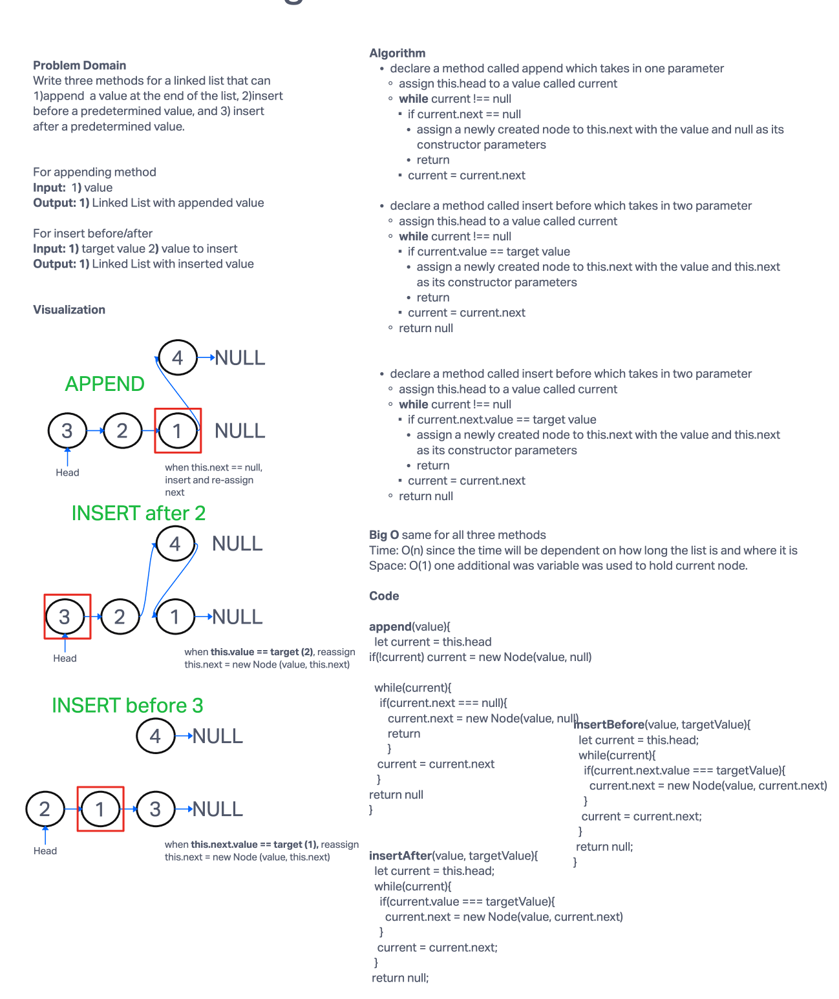

# Linked List Insertion

The goal of this challenge is to write three methods for a linked list that can 1)append  a value at the end of the list, 2)insert before a predetermined value, and 3) insert after a predetermined value.

## Whiteboard Process

## Approach & Efficiency

The approach as to rely on the vizualizatio to think out the states of current, which is critical for understanding what a linked list method might be doing.

BigO Time - O(n) since the time scaling is linear based on the size of the input\
BigO Space - O(1) since the size of the input and output does not change.

## Solution

Modification to the code after testing was needed.\
git clone this repository into a desired location.\
Inside the repository, run `npm install`.\
Navigate to the JavaScript folder and run `npm test linked-list.test.js`

[Linked List Construct](/javascript/linked-list/index.js)

[linked-list-insertions.test.js](./__test__/linked-list-insertions.test.js)
