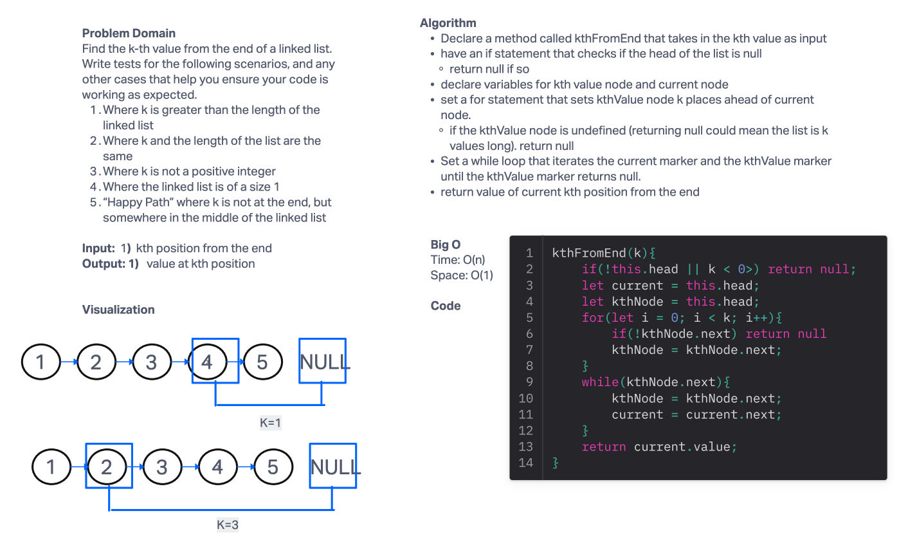

# Linked List Insertion

The goal of this challenge is to find the k-th value from the end of a linked list.

Write tests for:

1. Where k is greater than the length of the linked list
2. Where k and the length of the list are the same
3. Where k is not a positive integer
4. Where the linked list is of a size 1
5. “Happy Path” where k is not at the end, but somewhere in the middle of the linked list

## Whiteboard Process

## Approach & Efficiency

The approach as to rely on the visualization to think out the states of current in relation to the kth value node from current.

BigO Time - O(n) since the time scaling is linear based on the size of the input\
BigO Space - O(1) since the size of the input and output does not change.

## Solution

git clone this repository into a desired location.\
Inside the repository, run `npm install`.\
Navigate to the JavaScript folder and run `npm test linked-list-kth.test.js`

[Linked List Construct](/javascript/linked-list/index.js)

[linked-list-kth.test.js](./__test__/linked-list-kth.test.js)
