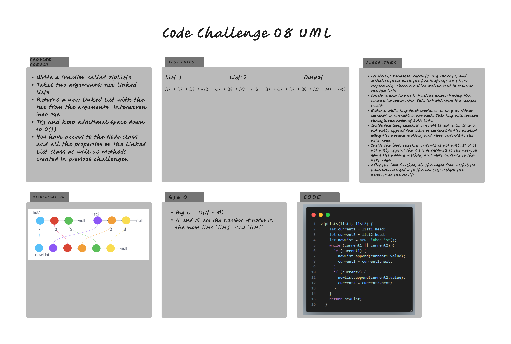

# Linked List Insertion

The goal of this challenge is to zip two linked lists.

Write tests for:

1. Write a function called zip lists
2. Arguments: 2 linked lists
3. Return: New Linked List, zipped as noted below
4. Zip the two linked lists together into one so that the nodes alternate between the two lists and return a reference to the the zipped list.
5. Try and keep additional space down to O(1)
6. You have access to the Node class and all the properties on the Linked List class as well as the methods created in previous challenges.

## Whiteboard Process

## Approach & Efficiency

BigO Time - O(n) since the time scaling is linear based on the size of the input\
BigO Space - O(1) since the size of the input and output does not change.

## Solution

git clone this repository into a desired location.\
Inside the repository, run `npm install`.\
Navigate to the JavaScript folder and run `npm test linked-list-kth.test.js`

[Linked List Zip Function](/javascript/linked-list/index.js)

[linked-list-zip.test.js](./__test__/linked-list-zip.test.js)
