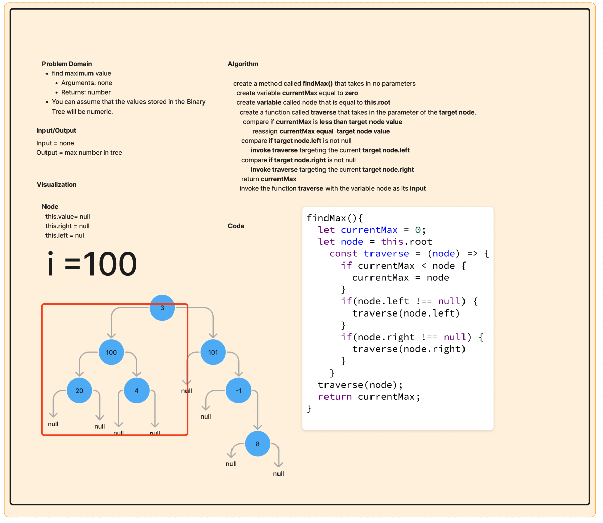

# Stack and Queue Implementation

## Problem Domain

The goal of this challenge was to find the maximum value of a binary tree using a built in method. This method will take no input parameter and will return the max number in the list.

## Whiteboard Process

## Approach & Efficiency

The visualization step of whiteboarding was the best approach to tackle this challenge as picturing how these data structure operate in a First In Last Out for stacks and First In First Out for queues. The Big O time for this implementation of the findMax wis O(n) where n is the total number of nodes in the tree, while the space complex is O(1) as the size of the output will always be the same.

## Solution

git clone this repository into a desired location.\
Inside the repository, run `npm install`.\
Navigate to the JavaScript folder and run `npm test queue.test.js`
Run `npm test stack.test.js`

[Binary Tree](./../index.js)

[tree-implementation.test.js](./__test__/tree-max.test.js)
